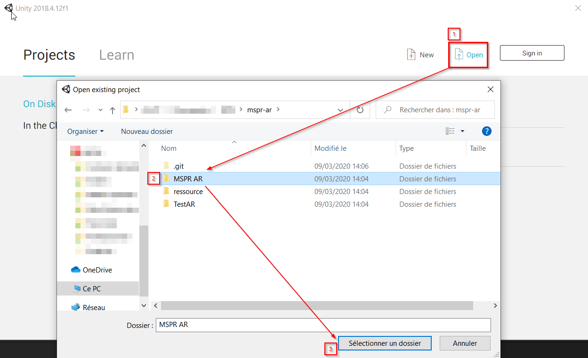
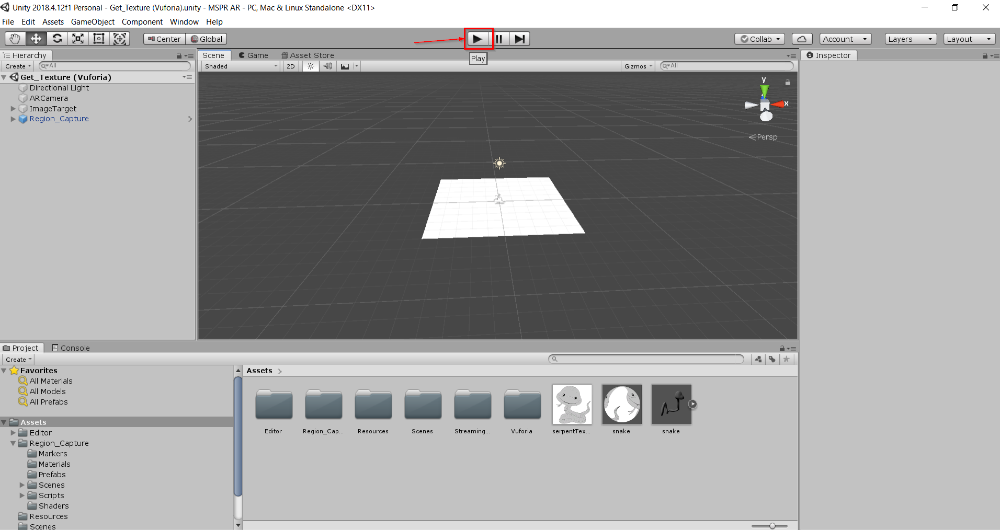

# Augmented Reality

An EPSI project

## How to build and run with Unity

First, clone the project :

`git clone git@github.com:victorienbaty/AR-EPSI.git`

Now you can open Unity and open the new directory

When Unity is launched, be sure you have no errors then click on "play" button :

That's it ! Now you can contribute or just have fun !

## Download the APK
